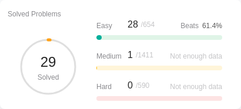

# My LeetCode
https://leetcode.com/sonohara/

## Testing
 

## Memo
### 難しかったリスト
https://leetcode.com/list?selectedList=ozmezud6
- [20. Valid Parentheses](https://leetcode.com/problems/valid-parentheses/)
  - 全然 Easy じゃなかった…
  - データ構造で考えないと解けない 
- [35. Search Insert Position](https://leetcode.com/problems/search-insert-position/)
  - 二分探索がそらで書けなかった…
    - 単純な二分探索じゃなくて、最小値以下 / 最大値以上のケースもあるのが余計にごちゃごちゃしてしまった
  - `left + ((right - left) / 2)` じゃなくて `(left + right) / 2` で出来るのは覚える 
- [70. Climbing Stairs](https://leetcode.com/problems/climbing-stairs/description/)
  - そもそもどうやって求めればよいか気付けず、discussion 見るまでコード書くまで至らなかった
  - fibonacci